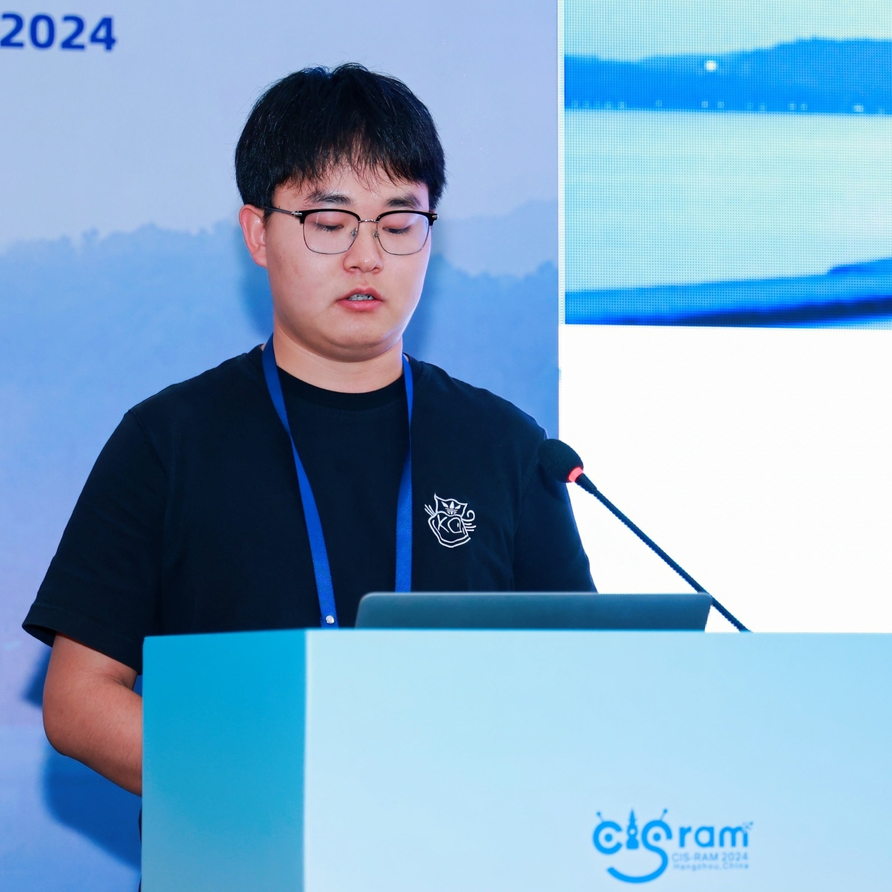

# 杨洪利

> 📞 `17860271144`&emsp;&emsp; ✉️ `hongli@stu.xju.edu.cn`&emsp;&emsp; 📒 [个人主页](https://baixf-xyz.github.io)

## 🎓教育经历

  <h3>新疆大学（211 双一流）- 硕士 - 计算机科学与技术 (081200)（2022.09 - 2025.06）</h3>

- 导师：黄浩教授，新疆多语种信息技术重点实验室  
- 研究方向：多语言语音识别、大模型、迁移学习、提示工程、语音合成  
- 专业成绩：GPA 85.5/100（专业前20%）  
- 主修课程包括：计算机科学与技术数学基础、矩阵分析、高级算法分析与设计、高级软件工程、机器学习、自然语言处理、深 度学习、人工智能原理及应用等

  <h3>青岛科技大学 - 本科 - 计算机科学与技术（数据分析与应用方向）（2018.09 - 2022.06）</h3>

- GPA 2.92/4.00  
- 主修课程包括：C语言程序设计、Java程序设计、Web前端开发技术、Linux 系统应用、Python 程序设计、数据库原理、数据采 集与存储、大数据处理、数据分析技术、大数据开发、数据可视化、遥感数字图像处理、人工智能等

## 实习经历

  <h3>研究助理（语音语义大数据实验室） - 深圳市大数据研究院（2023.07 - 2024.03）</h3>

- 指导老师：李海洲教授  
- 参与语音技术相关研究，协助语音对话系统的开发与模型分析

  <h3>交流学生（线上）- 南洋理工大学 Tesemak 实验室（2023.06 - 2024.06）</h3>

- 指导老师：Eng Siong Chng 教授  
- 跟踪语音大模型方向的研究前沿，参与相关科研项目交流

  <h3>教学助理 - 虚拟仿真综合实验实训中心，青岛科技大学（2019.04 - 2021.06）</h3>

- 协助教学系统维护，参与软硬件安装和实验环境管理

## 项目经历

### 邮电多语言语音识别智能眼镜开发（2025.03 - 2025.06）

- 训练语种识别模型，协助部署流式语音识别模型

### 类脑听觉注意力理论与工程化实践（2023.07 - 2024.04）

- 设计基于眼动仪的视觉注意力辅助系统，支持听力障碍人群识别目标说话者语音  

### 复杂声学场景下的语音内容审核关键技术研究（2022.10 - 2023.12）

- 使用语音分离、识别等手段进行语音关键词检索，提升内容审核效率

### 科技创新 2030 “新一代人工智能”重大项目（2022.10 - 2024.01）

- 多语言语音识别方向，涵盖低资源与富语种语音识别

## 📚 发表论文

- **Listen to the Speaker in Your Gaze**  
  ***Hongli Yang***, Xinyi Chen, Junjie Li, Siqi Cai, Hao Huang, Haizhou Li  
  *11th IEEE International Conference on Cybernetics and Intelligent Systems and the 11th IEEE International Conference on Robotics, Automation and Mechatronics(CIS-RAM 2024)*

- **CB-PSR: Adaptive Contextual Biasing for Prompt-driven Speech Recognition**  
  ***Hongli Yang***, Ziyuan Chen, Haowen Yin, Hao Huang  
  *21st International Conference on Intelligent Computing (ICIC 2025)*

- **Adapting Whisper for Parameter-efficient Code-Switching Speech Recognition via Soft Prompt Tuning**  
  ***Hongli Yang*,** Yizhou Peng, Hao Huang, Sheng Li  
  *26th Annual Conference of the International Speech Communication Association(Interspeech 2025)*

- **Language-Aware Prompt Tuning for Parameter-Efficient Seamless Language Expansion in Multilingual ASR**  
  ***Hongli Yang***, Sheng Li, Hao Huang, Ayiduosi Tuohan, Yizhou Peng  
  *26th Annual Conference of the International Speech Communication Association(Interspeech 2025)*

- **Robust and Efficient Text-based Speech Editing using Noise Conditioning and Rectified Flow**  
  Haowen Yin, Kai Wang, ***Hongli Yang***, Hao Huang, Wushour Silamu  
  *2025 International Conference on Acoustics, Speech, and Signal Processing(ICASSP 2025)*

## 🛠 专业技能

- 编程语言：Python、C、Shell、SQL  
- 技术框架与工具：PyTorch、Kaldi、Spark、MongoDB、ELK Stack、Jupyter  
- 熟悉自然语言处理、语音识别、SpeechLLM、深度学习、模型调优  
- 掌握数据采集、分析、可视化及模型评估流程  
- 英语六级（CET-6），普通话二级乙等

## 🏅 荣誉奖励

- 全国大学生数学建模竞赛省一等奖  
- “互联网+”“创青春”计算机软硬件组装类大赛三等奖  
- 自治区学业奖学金、科技创新奖学金、道德风尚奖学金、社会实践奖学金  
- 优秀志愿者、学生会优秀干事、社团联优秀干事、文艺体育积极分子等

## 💼 校园活动

- 青岛科技大学 学生工作助理委员会 宣传部部长（2019.09 - 2020.06）  
- 青岛科技大学  校团委学生社团管理部 素拓部部长（2019.09 - 2020.09）  
- 山东蒙阴大学生实践锻炼夏令营成员（2019.07 - 2019.08）